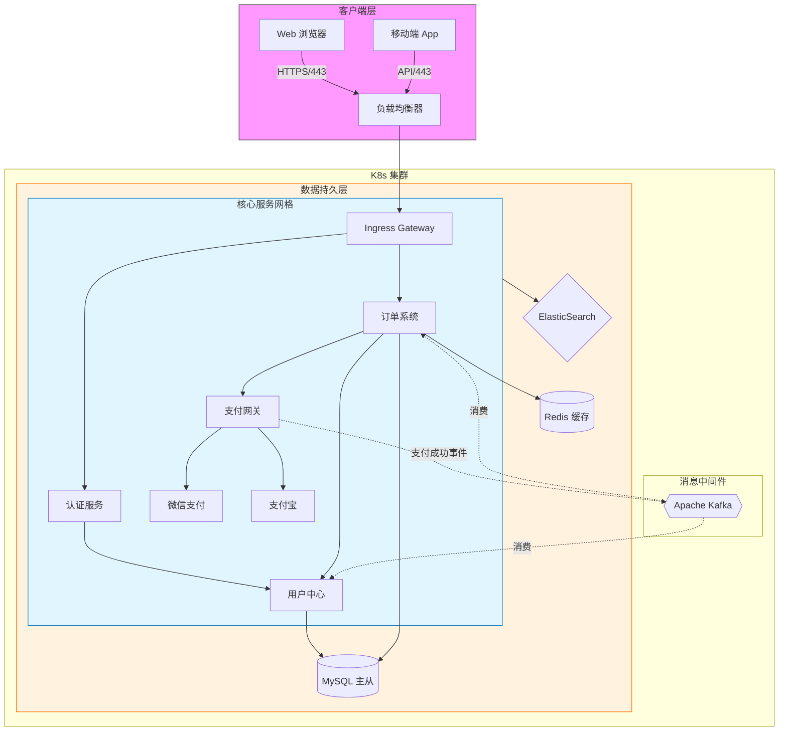
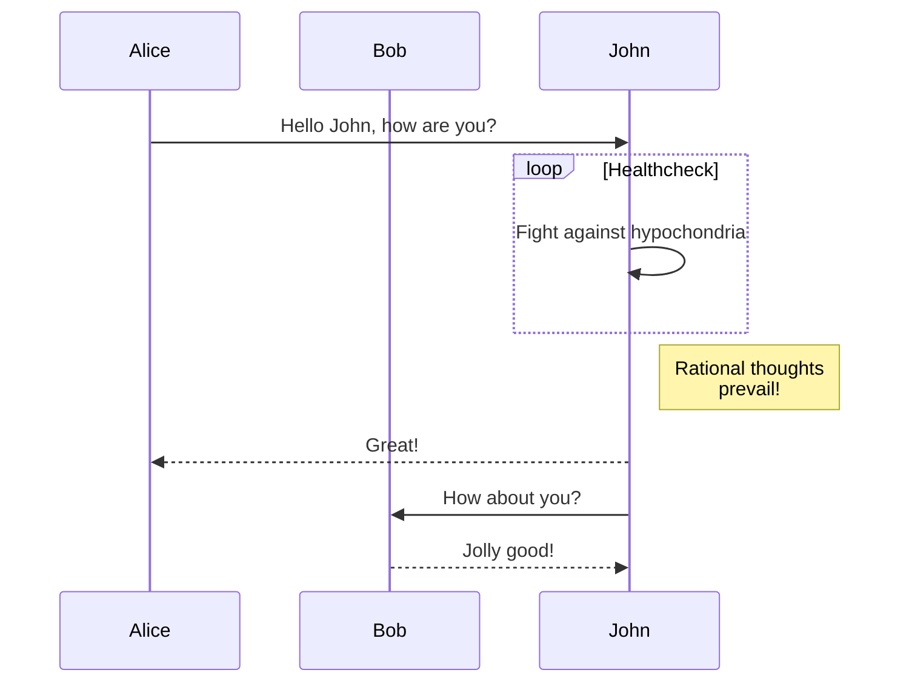
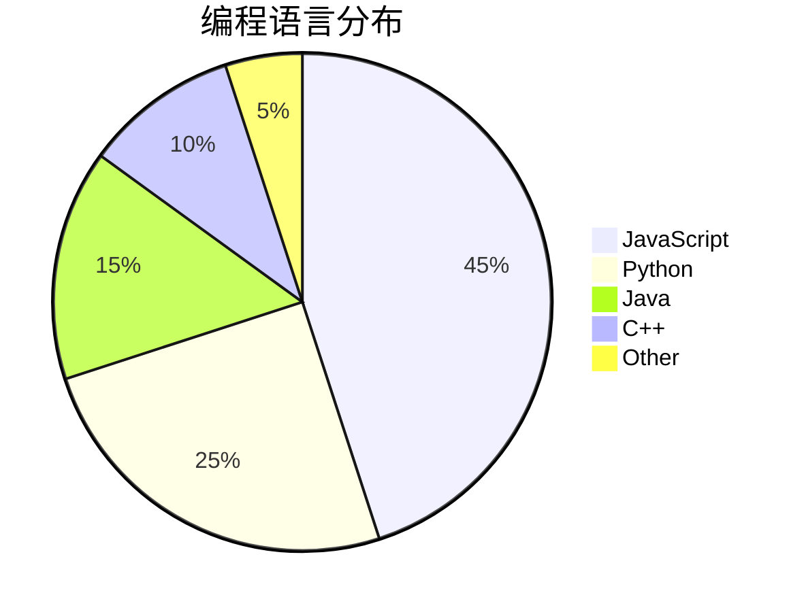
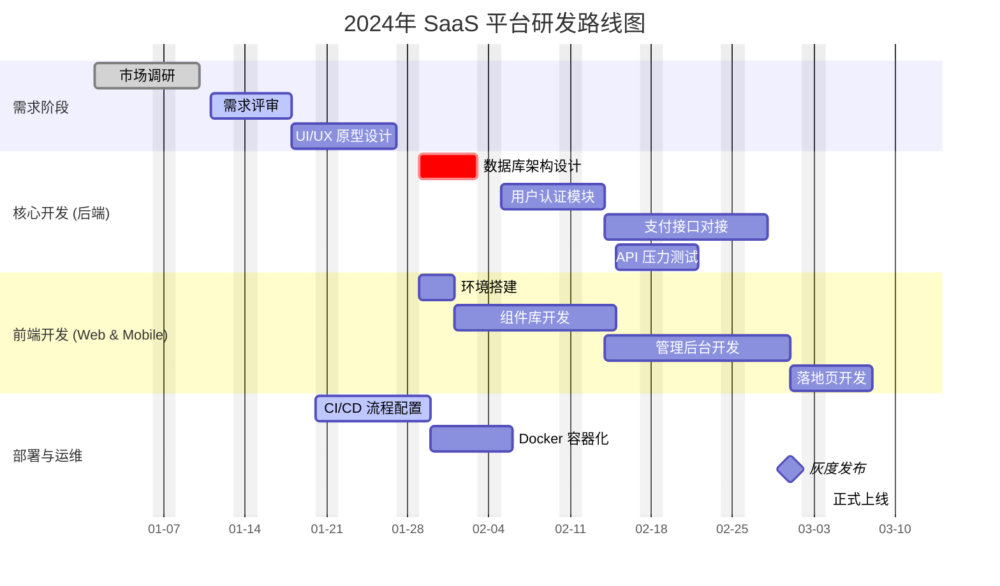

## 1. 标题

# 一级标题 (H1)

## 二级标题 (H2)

### 三级标题 (H3)

#### 四级标题 (H4)

##### 五级标题 (H5)

###### 六级标题 (H6)

```markdown title="titles.md"
# 一级标题 (H1)

## 二级标题 (H2)

### 三级标题 (H3)

#### 四级标题 (H4)

##### 五级标题 (H5)

###### 六级标题 (H6)
```

---

## 2. 文本样式

_这是斜体文本_
_这也是斜体文本_

**这是粗体文本**
**这也是粗体文本**

**_这是粗斜体文本_**
**_这也是粗斜体文本_**

~~这是带删除线的文本~~

这是一个 `行内代码` 的例子。

> 这是一个块引用。
>
> > 这是一个嵌套的块引用。

```markdown title="text_styles.md"
_这是斜体文本_
_这也是斜体文本_

**这是粗体文本**
**这也是粗体文本**

**_这是粗斜体文本_**
**_这也是粗斜体文本_**

~~这是带删除线的文本~~

这是一个 `行内代码` 的例子。

> 这是一个块引用。
>
> > 这是一个嵌套的块引用。
```

---

## 3. 列表

### 无序列表

- 列表项 A
- 列表项 B
  - 嵌套列表项 B1
  - 嵌套列表项 B2
- 列表项 C

```markdown title="unordered_list.md"
- 列表项 A
- 列表项 B
  - 嵌套列表项 B1
  - 嵌套列表项 B2
- 列表项 C
```

### 有序列表

1.  第一项
2.  第二项
    1.  嵌套第一项
    2.  嵌套第二项
3.  第三项

```markdown title="ordered_list.md"
1.  第一项
2.  第二项
    1.  嵌套第一项
    2.  嵌套第二项
3.  第三项
```

### 任务列表

这是 GitHub Flavored Markdown 的内容，在这里同样可用。

- [x] 已完成的任务
- [ ] 未完成的任务
- [ ] 待办事项

```markdown title="task_list.md"
- [x] 已完成的任务
- [ ] 未完成的任务
- [ ] 待办事项
```

---

## 4. 代码块

这是一个行内代码块：`console.log('Hello, World!');`

```markdown title="inline_code.md"
这是一个行内代码块：`console.log('Hello, World!');`
```

代码块的顶端会展示文件名，右上角会展示语言。文件名是可选的，在书写代码块时，在语言右侧空一格加入 `title` 标记即可。

注意如果不写文件名，那么代码语言也不会显示。

````markdown
```python title="hello.py"
import antigravity

def greet(name):
    """这是一个向世界问好的函数"""
    print(f"Hello, {name}!")

if __name__ == "__main__":
    greet("Markdown")
```
````

效果如下，这是一个带有语法高亮的 Python 代码块：

```python title="hello.py"
import antigravity

def greet(name):
    """这是一个向世界问好的函数"""
    print(f"Hello, {name}!")

if __name__ == "__main__":
    greet("Markdown")
```

这是一个没有指定语言的普通代码块：

```text title="plain.txt"
npm install
npm run dev
```

---

## 5. 链接与图片

### 链接

这是一个指向 [OpenAI](https://www.openai.com) 的链接。

### 图片


---

## 6. 表格

| 对齐方式 | 左对齐 | 居中对齐 | 右对齐 |
| :------- | :----- | :------: | -----: |
| **内容** | Cell 1 |  Cell 2  | Cell 3 |
| **示例** | a      |    b     |      c |
| **数据** | 123    |   456    |    789 |

---

## 7. 脚注

```markdown title="Shisouhan.md"
他人に優しいあんたにこの心がわかるものか

人を呪うのが心地良い だから詩を書いていた

朝の報道ニュースにいつか載ることが夢だった

その為に包丁を研いでる

总以温柔待人的你，要怎么明白我的这颗心？

诅咒别人让我快乐，所以我才致力于写诗

登上早间新闻，向来是我的梦想

为此我不停打磨着菜刀

——《思想犯》[^1]。

[^1]: 《思想犯》是日本摇滚乐团ヨルシカ（YORUSHIKA）创作于 2020 年的歌曲。歌名来自乔治·奥威尔出版于 1949 年的同名小说。
```

他人に優しいあんたにこの心がわかるものか

人を呪うのが心地良い だから詩を書いていた

朝の報道ニュースにいつか載ることが夢だった

その為に包丁を研いでる

总以温柔待人的你，要怎么明白我的这颗心？

诅咒别人让我快乐，所以我才致力于写诗

登上早间报道的新闻，向来是我的梦想

为此我不停打磨着菜刀

——《思想犯》[^1]。

## 8. 数学公式 （KaTeX）

Haku 支持 LaTeX 语法的数学公式以及化学公式渲染。

### 行内公式

质能方程是 $ E=mc^2 $。当 $ a \ne 0 $ 时，二次方程 $ ax^2 + bx + c = 0 $ 的解为 $ x = {-b \pm \sqrt{b^2-4ac} \over 2a} $。

```latex title="Mass_Energy_Equivalent_Formula_(Einstein).tex"
质能方程是 $ E=mc^2 $。当 $ a \ne 0 $ 时，二次方程 $ ax^2 + bx + c = 0 $ 的解为 $ x = {-b \pm \sqrt{b^2-4ac} \over 2a} $。
```

### 块级公式

麦克斯韦方程组 (积分形式):

$$

\oint_S \mathbf{D} \cdot d\mathbf{a} = Q_{in} \\
\oint_S \mathbf{B} \cdot d\mathbf{a} = 0 \\
\oint_C \mathbf{E} \cdot d\mathbf{l} = - \frac{d\Phi_B}{dt} \\
\oint_C \mathbf{H} \cdot d\mathbf{l} = I_{in} + \frac{d\Phi_D}{dt}


$$

```latex title="Maxwell.tex"
$$

\oint_S \mathbf{D} \cdot d\mathbf{a} = Q_{in} \\
\oint_S \mathbf{B} \cdot d\mathbf{a} = 0 \\
\oint_C \mathbf{E} \cdot d\mathbf{l} = - \frac{d\Phi_B}{dt} \\
\oint_C \mathbf{H} \cdot d\mathbf{l} = I_{in} + \frac{d\Phi_D}{dt}

$$
```

---

## 9. Mermaid 图表渲染

Haku 支持多种 mermaid 图表。

### 流程图

这是一个极为复杂的流程图。

````markdown title="services.md"

````


### 序列图

````markdown title="greetings.md"

````


### 饼图

````markdown title="code_langs.md"

````


### 甘特图

````markdown title="saas_route.md"

````


---

## 10. 提示/警告块

这种语法在 GitHub、Docsify 和许多文档生成器中很流行。

```markdown title="notifications.md"
> [!NOTE]
> 这是一个提示（Note）。用于引起注意的普通信息。

> [!TIP]
> 这是一个技巧（Tip）。用于提供有用的建议或快捷方式。

> [!IMPORTANT]
> 这是重要信息（Important）。需要用户特别关注的内容。

> [!WARNING]
> 这是一个警告（Warning）。用于提示潜在的风险或需要谨慎操作的地方。

> [!CAUTION]
> 这是一个危险警告（Caution）。表示执行此操作可能会导致严重后果。

:::note[自定义标题]
这是一个自定义标题的提示块。
:::
```

> [!NOTE]
> 这是一个提示（Note）。用于引起注意的普通信息。

> [!TIP]
> 这是一个技巧（Tip）。用于提供有用的建议或快捷方式。

> [!IMPORTANT]
> 这是重要信息（Important）。需要用户特别关注的内容。

> [!WARNING]
> 这是一个警告（Warning）。用于提示潜在的风险或需要谨慎操作的地方。

> [!CAUTION]
> 这是一个危险警告（Caution）。表示执行此操作可能会导致严重后果。

:::note[自定义标题]
这是一个自定义标题的提示块。
:::

---

## 11. HTML 标签

可以直接书写大多数 HTML 标签。

```html title="styles.html"
这段文字应该是 <span style="color: #007bff;">蓝色</span> 的，而这段是
<span style="color: #dc3545;">红色</span> 的。

H<sub>2</sub>O

X<sup>n</sup> + Y<sup>n</sup> = Z<sup>n</sup>

<abbr title="Graphics Interchange Format">GIF</abbr> 是一种位图图像格式。

书籍是人类进步的<del>楼梯</del>阶梯。

优秀的作家总是会仔细检查<u title="拼写">拚写</u>问题。

按下 <kbd>Ctrl</kbd> + <kbd>Alt</kbd> + <kbd>Delete</kbd> 以结束会话。

大多数<mark>蝾螈</mark>昼伏夜出，以昆虫、蠕虫等小生物为食。

使用三个连字符 `---` 或 `<hr>` 标签，即可创建如下分隔线。

---
```

使用 HTML 标签来改变文本颜色：这段文字应该是
<span style="color: #007bff;">蓝色</span> 的，而这段是
<span style="color: #dc3545;">红色</span> 的。

H<sub>2</sub>O

X<sup>n</sup> + Y<sup>n</sup> = Z<sup>n</sup>

<abbr title="Graphics Interchange Format">GIF</abbr> 是一种位图图像格式。

书籍是人类进步的<del>楼梯</del>阶梯。

优秀的作家总是会仔细检查<u title="拼写">拚写</u>问题。

按下 <kbd>Ctrl</kbd> + <kbd>Alt</kbd> + <kbd>Delete</kbd> 以结束会话。

大多数<mark>蝾螈</mark>昼伏夜出，以昆虫、蠕虫等小生物为食。

使用三个连字符 `---` 或 `<hr>` 标签，即可创建如下分隔线。

---

## 12. 折叠块

用 `:::fold[-]`创建折叠块。

:::fold[点击展开查看详细信息]
这里是隐藏的详细内容。可以包含段落、列表、甚至是图片。
:::

```markdown title="collapsible.md"
:::fold[点击展开查看详细信息]
这里是隐藏的详细内容。可以包含段落、列表、甚至是图片。
:::
```

[^1]: 《思想犯》是日本摇滚乐团ヨルシカ（YORUSHIKA）创作于 2020 年的歌曲。歌名来自乔治·奥威尔出版于 1949 年的同名小说。
